<!--
  4LPH7 — Profile README
  Minimal. Technical. Dynamic.
-->

 

---

## `whoami`

  

I build practical systems around **security, AI, data and automation** — from agricultural intelligence and portfolio analytics to forensics and encrypted applications.

Currently exploring **ethical hacking, ML/LLMs, real-time systems, Linux, Docker and self-hosting**.

---

## ⚡ Current Focus

<table>
<tr>
<td width="50%">

### 🔐 Cybersecurity

Ethical hacking, network security, web security, digital forensics and security automation.

</td>
<td width="50%">

### 🤖 Artificial Intelligence

Machine learning, LLMs, prediction systems, AI integrations and intelligent applications.

</td>
</tr>
<tr>
<td>

### 📊 Data Science

Data analysis, visualization, predictive modelling and real-world analytics.

</td>
<td>

### 🛠️ Engineering

Full-stack applications, APIs, Docker, Linux, databases and self-hosted infrastructure.

</td>
</tr>
</table>

---

## 🧰 Tech Arsenal

### 💻 Languages & Scripting

  

`Python` · `C/C++` · `Java` · `JavaScript` · `TypeScript` · `Bash` · `SQL` · `R`

### 🧠 AI, Data & Analytics

  

`NumPy` · `Pandas` · `Matplotlib` · `Scikit-learn` · `TensorFlow` · `PyTorch` · `XGBoost` · `Transformers` · `Jupyter`

### 🌐 Web & Application Development

  

`React` · `Next.js` · `Node.js` · `Django` · `Flask` · `FastAPI` · `REST APIs` · `Flutter`

### 🔐 Security & Systems

  

`Linux` · `Docker` · `Git` · `GitHub Actions` · `Digital Forensics` · `Network Security` · `Web Security` · `Security Automation`

### ☁️ Cloud, Databases & Developer Tools

  

`PostgreSQL` · `MySQL` · `MongoDB` · `Redis` · `Firebase` · `AWS` · `Cloudflare` · `Vercel` · `Postman`

---

# 🚀 Featured Projects

<table>
<tr>
<td width="50%" valign="top">

### 🌾 FPOLink TN

A digital operating system for **Farmer Producer Organisations**, piloting in Tamil Nadu.

Features include agricultural intelligence, price forecasting, multilingual dashboards and WhatsApp-based farmer communication.

**Stack**

`FastAPI` `PostgreSQL` `SQLAlchemy` `Next.js` `Docker` `XGBoost`

</td>
<td width="50%" valign="top">

### 📈 PortfolioIQ

A Python-based portfolio analytics platform built around market data and portfolio analysis, with a roadmap toward automated portfolio management.

**Stack**

`Python` `Pandas` `Kite Connect API` `Analytics`

</td>
</tr>
<tr>
<td width="50%" valign="top">

### 🧠 Mem_Scope

A memory forensics toolkit for analysing memory dumps, identifying suspicious patterns and extracting useful artifacts.

**Stack**

`Python` `Digital Forensics`

</td>
<td width="50%" valign="top">

### 🔐 Custom Cryptography Tool

A GUI-based encryption and decryption application built around a custom cryptographic algorithm.

**Stack**

`Python` `CustomTkinter` `Cryptography`

</td>
</tr>
</table>

---

# 📊 Live Stats

---

# 🌐 Connect

**BUILD • BREAK • LEARN • REPEAT**

