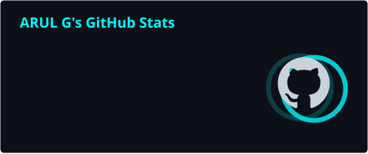
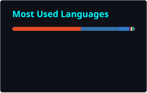

<!--
  4LPH7 — Profile README
  Minimal. Technical. Dynamic.
-->

 

---

## `whoami`

  

I build practical systems around **security, AI, data and automation** — from agricultural intelligence and portfolio analytics to forensics and encrypted applications.

Currently exploring **ethical hacking, ML/LLMs, real-time systems, Linux, Docker and self-hosting**.

---

## ⚡ Current Focus

<table>
<tr>
<td width="50%">

<b>🔐 Cybersecurity</b>

Ethical hacking, network security, web security, digital forensics and security automation.

</td>
<td width="50%">

<b>🤖 Artificial Intelligence</b>

Machine learning, LLMs, prediction systems, AI integrations and intelligent applications.

</td>
</tr>
<tr>
<td>

<b>📊 Data Science</b>

Data analysis, visualization, predictive modelling and real-world analytics.

</td>
<td>

<b>🛠️ Engineering</b>

Full-stack applications, APIs, Docker, Linux, databases and self-hosted infrastructure.

</td>
</tr>
</table>

---

## 🧰 Tech Arsenal
 
<table>
<tr>
<td width="50%" align="center">
💻 Languages & Scripting
 
        
 
</td>
<td width="50%" align="center">
🧠 AI, Data & Analytics
 
       
 
</td>
</tr>
<tr>
<td align="center">
🌐 Web & Application Development
 
          
 
</td>
<td align="center">
🔐 Security & Systems
 
         
 
</td>
</tr>
<tr>
<td colspan="2" align="center">
☁️ Cloud, Databases & Dev Tools
 
        
 
</td>
</tr>
</table>

# 🚀 Featured Projects

<table>
<tr>
<td width="50%" valign="top">

### 🌾 FPOLink TN

A digital operating system for **Farmer Producer Organisations**, piloting in Tamil Nadu.

Features include agricultural intelligence, price forecasting, multilingual dashboards and WhatsApp-based farmer communication.

**Stack**

`FastAPI` `PostgreSQL` `SQLAlchemy` `Next.js` `Docker` `XGBoost`

</td>
<td width="50%" valign="top">

### 📈 PortfolioIQ

A Python-based portfolio analytics platform built around market data and portfolio analysis, with a roadmap toward automated portfolio management.

**Stack**

`Python` `Pandas` `Kite Connect API` `Analytics`

</td>
</tr>
<tr>
<td width="50%" valign="top">

### 🧠 Mem_Scope

A memory forensics toolkit for analysing memory dumps, identifying suspicious patterns and extracting useful artifacts.

**Stack**

`Python` `Digital Forensics`

</td>
<td width="50%" valign="top">

### 🔐 Custom Cryptography Tool

A GUI-based encryption and decryption application built around a custom cryptographic algorithm.

**Stack**

`Python` `CustomTkinter` `Cryptography`

</td>
</tr>
</table>

---

# 📊 Live Stats

---

# 🌐 Connect

**BUILD • BREAK • LEARN • REPEAT**

